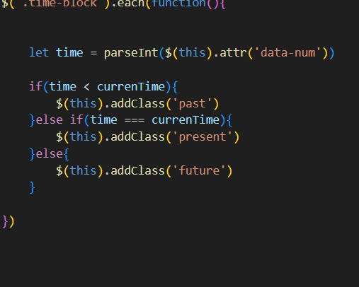

# daily-planner-app

## Description 

In this task i created a daily planner app using jquer 

1. i added the current day bus using day.js and choosing one of the formats from the website to display the date

2. Next i create the timeblocks by using a for loop, first creating an array that would contain the times for each block

part 1

part 2

3. i then colour coded the timeblocks by using the dayjs website to see how i could get a 1-23 hour format and saved it into a variable currentime and used parseInt to convert it to a number 

4. i then used each to loop through my blocks data-num that i previously used to store the numbers in the array to their respective blocks in my previous for loop, stored it into a variable  and used an if statement to determine if the current time was in the past present or the future and change the color of the block depending on the time

5. i then created the save button and attached it to a function that would store the values entered in the textarea to a localstorage and display it even when the page gets refreshed

